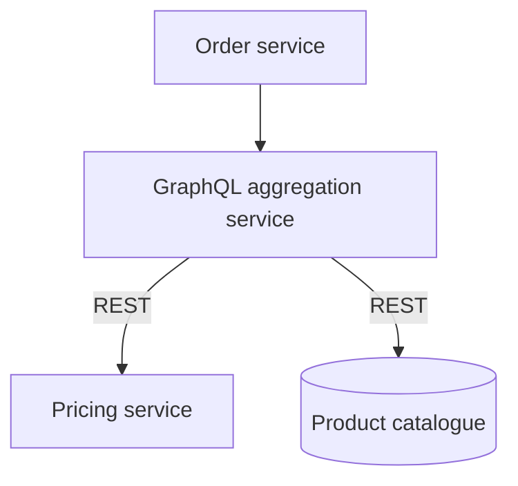
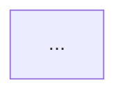

# Diagram images

Renders the ` ```mermaid ` blocks in a document to image files, styled from one shared theme.

The point is not one good-looking diagram. It is that the twentieth diagram, in the fourth document, written three months later, still looks like it belongs with the first. That is achieved by construction rather than by care: **the diagram source contains topology and labels only, and the theme contains every visual decision.** A diagram cannot drift stylistically if it has no styling in it.

## Requirements

Node 18+, `npm`, and a Chrome, Chromium or Edge install (set `CHROME_PATH` if it is not in a standard location). There is no puppeteer, no mermaid-cli and no Docker: the first run installs a pinned `mermaid` into `~/.cache/diagram-images` (a few seconds, needs network once), and every render runs it in your browser, headless.

Vocabulary classes and the lint only apply to **flowcharts** (`graph` / `flowchart`). Other Mermaid diagram types render with the theme's colours and font but get no vocabulary and are not checked.

## Workflow

**1. Write the diagram with the vocabulary, not with colours.**

Read `assets/shape-vocabulary.md` before writing any diagram. Every node gets a class:



No `classDef`, no `style`, no `%%{init}%%`, no front-matter `config:`, no hex codes. If a needed kind of thing is missing from the vocabulary, add it to the theme, not to the diagram.

The optional `%% id: name` comment names the diagram's image file. Without it the file is named by position and heading (`proposal-02-central-aggregation.svg`), so inserting a diagram or renaming a heading renames every later image and breaks the links to it. Give any diagram that other documents or a deck link to an id.

**2. Lint for drift.**

```bash
node ${CLAUDE_SKILL_DIR}/scripts/lint-diagrams.mjs docs/proposal.md
```

Flags inline styling and config overrides, unknown classes, unclassed nodes (including `class A,B name` statements), a class drawn in the wrong shape (a `datastore` that is not a cylinder), more than one `platform` node, and non-flowchart diagrams. Fix findings before rendering. Pass `--theme PATH` if you render with a different house style.

**3. Render.**

```bash
node ${CLAUDE_SKILL_DIR}/scripts/render-diagrams.mjs docs/proposal.md
```

Writes `docs/images/proposal-<id or NN-section>.svg`, one per block, and prints markdown snippets to embed them (relative to the document, also with `--out`), plus the size of each file. Re-running overwrites. Images that an earlier run wrote for this document but the current source no longer produces are deleted; the bookkeeping lives in `images/.<doc>.diagram-images.json`, which should be committed with the images.

Options: `--format png` (when the target cannot take SVG, see Size), `--scale N` (png device scale, default 2), `--out DIR`, `--bg "#FAFAF8"`, `--only 3` (one diagram while iterating, single input file only; skips the stale-image cleanup), `--theme PATH` (a different house style), `--raw` (skip SVG minification).

**4. Look at the output.**

SVG cannot be viewed directly, so render a PNG to a scratch directory and read that back:

```bash
node ${CLAUDE_SKILL_DIR}/scripts/render-diagrams.mjs docs/proposal.md --format png --out "$(mktemp -d)"
```

Check it. Mermaid's auto-layout can place things in a way that reads wrong even when the source is right: crossed edges, a node that landed far from what it relates to, a rank order that implies a sequence that does not exist. Layout is influenced by declaration order and edge direction, so reorder the source rather than reaching for styling.

## Embedding the images in the document

Put the image where the diagram belongs and collapse the source under it, so readers see the picture and the master copy stays in the file:

````markdown


<details><summary>Diagram source</summary>



</details>
````

The blank lines around the fence are required, or the markdown inside `<details>` will not parse. Rendering and linting still find blocks wrapped this way. A ` ```mermaid ` block shown inside a longer fence or inside another language's code block (as above) is documentation, not a diagram, and is ignored.

## Size and portability

**SVG is the default and should stay the default.** The hand-drawn look is expensive as raster: rough.js fills shapes with diagonal hachure strokes, which is close to the worst case for PNG compression, and a 3x scale factor multiplies that by nine. The same five diagrams came to 3.1 MB as 3x PNG and 284 KB as minified SVG, while staying sharp at any zoom.

Levers, in the order worth reaching for:

1. **Stay on SVG.** Roughly a 90% saving on its own, and no resolution to choose.
2. **Minification is automatic.** Rough.js writes coordinates at full float precision (`-73.65628193913531`); the renderer rounds these to two decimals, which is visually identical and halves the file. `--raw` disables it.
3. **Theme metrics** (`fontSize`, `nodeSpacing`, `rankSpacing`, `padding`, `wrappingWidth`) set the natural dimensions of every diagram. Lower them here rather than scaling images down afterwards.
4. **If PNG is unavoidable**, `--scale 2` is enough for screen and print; `--scale 3` roughly doubles the file for no visible gain at normal sizes.

If one diagram is far larger than the rest, the cause is usually layout rather than encoding: nodes with no edges between them land on the same rank, so a subgraph of four unconnected nodes renders as one very wide row. Restructure the diagram instead of shrinking the image.

**Labels are plain SVG `<text>`** (`htmlLabels` is off in the theme), not `<foreignObject>` HTML, so the SVGs also open in PowerPoint, Keynote, Google Slides, Inkscape and rsvg. Keep it off.

**Fonts are referenced by name, not embedded.** An SVG shows the handwriting font only on machines that have it, and elsewhere falls back to generic cursive in a box sized for the original font, so long labels can overflow. When the picture must look identical wherever it lands (a slide deck, an email, a PDF), use `--format png`: the font is baked in at render time.

## Style

The house style is hand-drawn: sketched borders via `look: handDrawn`, and a handwriting font stack (Bradley Hand, falling back through Noteworthy, Marker Felt, Comic Sans MS, Segoe Print, then generic cursive). The sketched look reads as "this is a proposal, argue with it" rather than "this is the built system", which suits an ADR or position paper.

**`handDrawnSeed` must stay pinned.** Rough.js randomises the wobble of every line. With no fixed seed, re-rendering an unchanged diagram produces different borders each time, so every render dirties the file: drift, reintroduced by the styling itself. The seed is set to 42 in the theme. Do not remove it, and change it only if you want the whole set to re-sketch at once. For the same reason the mermaid version is pinned in `render-diagrams.mjs`; bump it deliberately and re-render everything.

The handwriting fonts are macOS fonts. On a machine without them (CI, Linux) the diagrams render with the fallback and look different, so render on a machine that has the font, or install one and put it first in `fontFamily`.

Node colours are defined for each render mode in `themeCSS`: `.node.<class> rect` for the classic look, and `.rough-node.<class> .label-container path:nth-of-type(1|2)` for the hand-drawn look, where rough.js emits the fill as path 1 and the outline as path 2, both with `fill:none`. Rhombus nodes have no `.label-container`; their paths are `.rough-node.decision > g:first-child > path`. Muted text is coloured through `text, tspan` because labels are SVG text. Keep all of these when adding a class, so flipping `look` back to `classic` does not silently strip the styling.

## Rules

**Keep the source in the markdown.** The ` ```mermaid ` block is the master copy and images are build output. Never hand-edit an image or keep a diagram only as an image: the next person cannot change it, and it will drift from the prose around it.

**One subject per diagram.** At most one `:::platform` node: it marks what the diagram is about. A diagram with two has two subjects and should be two diagrams. A flowchart that is not about a component (a decision tree) has none.

**Colour is redundant, never load-bearing.** Every node must read correctly in greyscale from its label and shape alone. The classes add emphasis to something the labels already say.

**A pair of diagrams that invite comparison must differ only where the real difference is.** When showing option A against option B, keep node names, positions, and classes identical between them, so the one thing that changed is the one thing the reader sees. This is where drift does the most damage: a cosmetic difference between two diagrams reads as a substantive one.

**Changing the theme changes every document.** That is the intent. After editing `assets/theme.json`, re-render all documents that use it, and check a few, since a theme change is global and unreviewed by default.

## Files

- `assets/theme.json` — the single source of visual truth: colours, typography, spacing, and the class definitions in `themeCSS`
- `assets/shape-vocabulary.md` — what each class means and which shape syntax it requires
- `scripts/render-diagrams.mjs` — extract and render (headless Chrome + pinned mermaid)
- `scripts/lint-diagrams.mjs` — drift check
- `scripts/lib.mjs` — diagram extraction and theme loading shared by both
