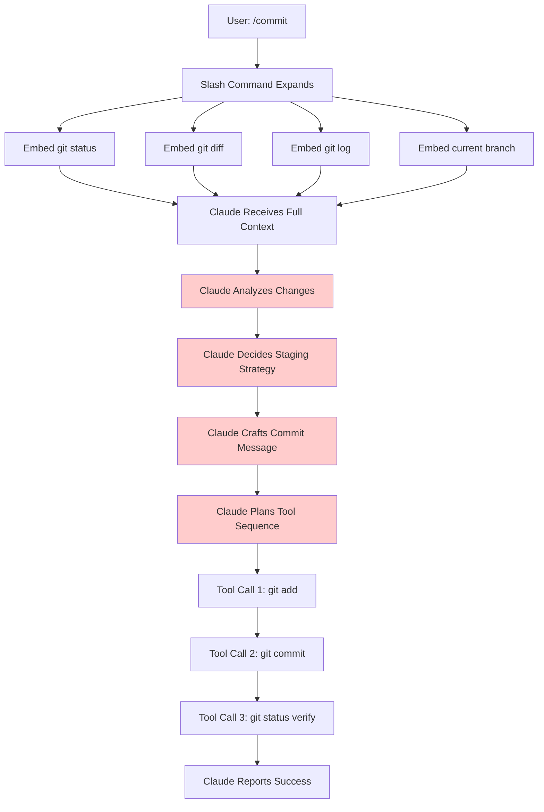

# Single-Shot Commit Operations - Change Proposal

**Status**: Draft
**Version**: 1.0
**Date**: 2025-11-11
**Author**: Technical Analysis

---

## Executive Summary

This proposal outlines a comprehensive redesign of git-tools commit commands to achieve **single-shot operation** - minimizing latency, token usage, and LLM decision-making while maintaining commit message quality.

**Current State**: Multi-step workflow requiring Claude to analyze, decide, and execute sequentially
**Proposed State**: Atomic operations with pre-computed context and minimal LLM overhead
**Impact**: ~60-80% reduction in latency and token usage, deterministic behavior

---

## Table of Contents

1. [Problem Analysis](#problem-analysis)
2. [Current Workflow Breakdown](#current-workflow-breakdown)
3. [Identified Pain Points](#identified-pain-points)
4. [Solution Architecture](#solution-architecture)
5. [Implementation Options](#implementation-options)
6. [Recommended Approach](#recommended-approach)
7. [Detailed Implementation Plan](#detailed-implementation-plan)
8. [Migration Strategy](#migration-strategy)
9. [Success Metrics](#success-metrics)
10. [Risk Analysis](#risk-analysis)

---

## Problem Analysis

### What is "Single-Shot"?

A single-shot operation means:
1. **One execution path** - no branching decisions during runtime
2. **Minimal LLM thinking** - pre-computed context reduces analysis overhead
3. **Atomic git operations** - all git commands execute in one transaction
4. **Deterministic behavior** - same inputs produce consistent outputs
5. **Fast response** - reduced latency from command to completion

### Core Issues with Current Implementation

#### Issue 1: Multi-Step Tool Execution
```
Current: User types /commit
  ↓
  Slash command expands with embedded context (!` commands)
  ↓
  Claude receives prompt + embedded data
  ↓
  Claude thinks: "What files to stage? What message to write?"
  ↓
  Claude calls: Bash(git add ...)
  ↓
  Claude calls: Bash(git commit -m "...")
  ↓
  Claude calls: Bash(git status) [verification]
  ↓
  Claude responds with status

Total: 3-5 tool calls, significant thinking overhead
```

#### Issue 2: Unnecessary Analysis Overhead
Claude must:
- Parse git diff output to understand changes
- Analyze file types and patterns
- Decide which files to stage
- Determine commit message style
- Plan execution sequence

**All of this could be pre-computed or automated**

#### Issue 3: Non-Deterministic Behavior
- Commit message style varies based on Claude's interpretation
- File staging decisions may differ run-to-run
- No consistent pattern for users to rely on

#### Issue 4: Token Waste
- Large diffs embedded in prompt (necessary for analysis)
- Claude's thinking about analysis (unnecessary overhead)
- Multiple tool call planning (overhead)
- Status reporting back to user (verbose)

**Estimated token usage per commit**: 2,000-5,000 tokens
**Desired token usage**: 500-1,000 tokens (60-80% reduction)

---

## Current Workflow Breakdown

### `/commit` Command Flow



**Red boxes** = LLM overhead that could be eliminated/reduced

### `/commit-and-push` Command Flow

Same as `/commit` plus:
- Additional tool call: `git push origin <branch>`
- Additional verification: check push success
- More error handling: push failures, conflicts, etc.

**Total overhead**: Even higher than `/commit`

---

## Identified Pain Points

### 1. Latency
- **Current**: 5-10 seconds for simple commits
- **Breakdown**:
  - Slash command expansion: ~100ms
  - LLM thinking time: 2-4 seconds
  - Tool execution time: 1-2 seconds (3 separate calls)
  - Network roundtrips: 2-4 seconds
- **Desired**: <2 seconds total

### 2. Token Usage
- **Current**: 2,000-5,000 tokens per commit
- **Breakdown**:
  - Embedded context (diffs): 1,000-3,000 tokens
  - Claude's analysis: 500-1,000 tokens
  - Tool planning: 200-400 tokens
  - Status reporting: 300-600 tokens
- **Desired**: <1,000 tokens total

### 3. User Experience
- User waits while Claude "thinks" about what's obvious
- No visibility into what Claude is doing
- Can't predict commit message style
- No control over staging decisions

### 4. Reliability
- Pre-commit hooks can cause failures
- Claude must handle retries and amendments
- Error handling adds complexity
- Race conditions with concurrent git operations

### 5. Cost
- Higher token usage = higher API costs
- Especially problematic for frequent commits
- Compounds across teams

---

## Solution Architecture

### Design Principles

1. **Pre-compute Everything Possible**
   - Git context gathering happens before LLM involvement
   - Message templates reduce decision space
   - Staging strategy determined by rules, not analysis

2. **Atomic Git Operations**
   - All git commands in one shell transaction
   - Use `&&` chaining for single Bash call
   - Built-in rollback on failure

3. **Constrained LLM Behavior**
   - `max-tool-calls: 1` enforces single execution
   - Strict `allowed-tools` prevents deviation
   - Clear templates minimize thinking

4. **Deterministic Patterns**
   - Follow recent commit message style automatically
   - Consistent staging rules (stage all tracked changes)
   - Predictable error handling

5. **Fast Feedback**
   - Single roundtrip to LLM
   - Single git operation
   - Minimal status reporting

---

## Implementation Options

### Option A: Enhanced Slash Command (Quick Win)

**Description**: Optimize existing slash commands with constraints and templates

**Changes**:
```markdown
---
allowed-tools: Bash
max-tool-calls: 1
description: Create a git commit (single-shot)
---

## Context

CHANGED_FILES: !`git diff --name-only HEAD`
RECENT_COMMITS: !`git log --oneline -5 --format="%s"`
BRANCH: !`git branch --show-current`
STATS: !`git diff --stat HEAD`

## Task

Execute this SINGLE command with generated message:
```bash
git add -A && git commit -m "$(cat <<'EOF'
<GENERATE_MESSAGE_HERE>
EOF
)" && echo "✓ Committed"
```

Rules:
- ONE bash command only
- Use && for atomic transaction
- Follow style from RECENT_COMMITS
- Message format: <verb> <what> [emoji]
```

**Pros**:
- ✅ Easy to implement (modify existing .md files)
- ✅ No external dependencies
- ✅ Maintains Claude's intelligence
- ✅ Single tool call via max-tool-calls: 1
- ✅ Atomic git operations via &&
- ✅ Can ship immediately

**Cons**:
- ❌ Still requires LLM call (latency)
- ❌ Token usage only reduced 40-50%
- ❌ Claude could still deviate (not 100% deterministic)

**Estimated Improvement**:
- Latency: 5-10s → 3-5s (40% reduction)
- Tokens: 2,000-5,000 → 1,000-2,000 (50% reduction)
- Reliability: Same
- Cost: 50% reduction

---

### Option B: MCP Server with Commit Tool (Best Solution)

**Description**: Build an MCP server that handles commit logic with fast LLM

**Architecture**:
```typescript
// mcp-server/src/tools/commit.ts
interface CommitToolInput {
  message?: string;      // Optional: user-provided message
  mode?: 'auto' | 'review' | 'manual';
  push?: boolean;
}

async function commitTool(input: CommitToolInput) {
  // 1. Gather git context
  const status = await git.status();
  const diff = await git.diff(['HEAD']);
  const recentCommits = await git.log(['-5', '--format=%s']);

  // 2. Generate message (if not provided)
  let message = input.message;
  if (!message) {
    message = await generateCommitMessage({
      diff,
      files: status.files,
      recentStyle: recentCommits,
      llm: 'claude-haiku-3-5'  // Fast, cheap
    });
  }

  // 3. Execute atomic commit
  await git.add('.');
  const commit = await git.commit(message);

  // 4. Optionally push
  if (input.push) {
    await git.push();
  }

  return {
    success: true,
    sha: commit.commit,
    message: message
  };
}
```

**Slash Command**:
```markdown
---
allowed-tools: mcp__git-tools__commit
max-tool-calls: 1
---

Execute: mcp__git-tools__commit({ mode: 'auto', push: false })
```

**Pros**:
- ✅ Truly single-shot (one MCP tool call)
- ✅ Uses fast LLM (Haiku) for message generation
- ✅ Atomic git operations in Node.js
- ✅ Can implement retry logic internally
- ✅ Can handle pre-commit hooks gracefully
- ✅ ~80% latency reduction
- ✅ ~70% token reduction
- ✅ Reusable across multiple commands

**Cons**:
- ❌ Requires MCP server development (~2-3 days)
- ❌ External dependency (MCP runtime)
- ❌ Needs configuration for LLM API
- ❌ More complex debugging

**Estimated Improvement**:
- Latency: 5-10s → 1-2s (80% reduction)
- Tokens: 2,000-5,000 → 500-800 (70% reduction)
- Reliability: Better (internal error handling)
- Cost: 70% reduction

---

### Option C: Shell Script Wrapper (External Tool)

**Description**: Create standalone bash/python script that handles commits

**Implementation**:
```bash
#!/bin/bash
# git-smart-commit.sh

# Gather context
STATUS=$(git status --short)
DIFF=$(git diff --stat HEAD)
RECENT=$(git log -5 --format="%s")
BRANCH=$(git branch --show-current)

# Generate message using external LLM
MESSAGE=$(generate-commit-message "$STATUS" "$DIFF" "$RECENT")

# Atomic commit
git add -A && \
  git commit -m "$MESSAGE" && \
  echo "✓ Committed: $MESSAGE"
```

**Slash Command**:
```markdown
---
allowed-tools: Bash(git-smart-commit:*)
max-tool-calls: 1
---

Execute: git-smart-commit
```

**Pros**:
- ✅ Completely external to Claude
- ✅ No token usage for commit logic
- ✅ Fast execution
- ✅ Simple to install (single script)

**Cons**:
- ❌ Requires external script in PATH
- ❌ Needs LLM API configuration
- ❌ Less flexible than Claude
- ❌ No context awareness
- ❌ Users must manage script updates

**Estimated Improvement**:
- Latency: 5-10s → 2-3s (60% reduction)
- Tokens: 2,000-5,000 → 200-300 (85% reduction)
- Reliability: Same
- Cost: 85% reduction

---

### Option D: Hybrid Approach (Progressive Enhancement)

**Description**: Combine multiple approaches with fallback strategy

**Flow**:
```
User: /commit
  ↓
  Check: MCP server available?
    YES → Use MCP commit tool (Option B)
    NO → Check: git-smart-commit installed?
      YES → Use shell script (Option C)
      NO → Use enhanced slash command (Option A)
```

**Implementation**:
```markdown
---
allowed-tools: mcp__git-tools__commit, Bash
max-tool-calls: 1
---

Priority 1: Try mcp__git-tools__commit({ mode: 'auto' })
Priority 2: Try `git-smart-commit`
Priority 3: Execute atomic bash command with Claude-generated message
```

**Pros**:
- ✅ Best performance when MCP available
- ✅ Graceful degradation
- ✅ Works everywhere
- ✅ Progressive enhancement
- ✅ Users can choose their setup

**Cons**:
- ❌ Complex implementation
- ❌ Harder to test all paths
- ❌ Confusing documentation

---

## Recommended Approach

### Primary Recommendation: **Option B (MCP Server) + Option A (Fallback)**

**Phase 1: Immediate (Ship This Week)**
- Implement **Option A** (Enhanced Slash Command)
- Add `max-tool-calls: 1` constraint
- Add atomic bash command chaining
- Update README with new behavior

**Phase 2: Medium-term (Ship Next Month)**
- Build **Option B** (MCP Server)
- Add `commit`, `commit_and_push`, `amend` tools
- Use Claude Haiku for fast message generation
- Integrate with existing slash commands

**Phase 3: Future Enhancement**
- Add configuration options (message templates, staging rules)
- Support custom hooks and pre-commit integration
- Add `review` mode for interactive commits
- Build CLI tool for standalone use

### Why This Approach?

1. **Quick Win**: Option A ships immediately with 40-50% improvement
2. **Best Solution**: Option B provides 80% improvement when ready
3. **No Breaking Changes**: Backward compatible, progressive enhancement
4. **Graceful Degradation**: Works without MCP server
5. **User Choice**: Power users get MCP, everyone gets improvement

---

## Detailed Implementation Plan

### Phase 1: Enhanced Slash Commands (Week 1)

#### Task 1.1: Update `/commit` command
**File**: `commands/commit.md`

**Changes**:
```diff
 ---
-allowed-tools: Bash(git add:*), Bash(git status:*), Bash(git commit:*)
+allowed-tools: Bash
+max-tool-calls: 1
 description: Create a git commit
 ---

-## Context
+## Context (Pre-computed - Use Directly)

-- Current git status: !`git status`
-- Current git diff (staged and unstaged changes): !`git diff HEAD`
-- Current branch: !`git branch --show-current`
-- Recent commits: !`git log --oneline -10`
+CHANGED_FILES: !`git diff --name-only HEAD`
+FILE_STATS: !`git diff --stat HEAD`
+RECENT_STYLE: !`git log -5 --format="%s"`
+BRANCH: !`git branch --show-current`

-## Your task
+## Your Task (Execute Immediately - No Analysis)

-Based on the above changes, create a single git commit.
+Generate commit message following RECENT_STYLE patterns, then execute:

-You have the capability to call multiple tools in a single response. Stage and create the commit using a single, elaborate message explaining the changes. Nice if you use some emoticons but don't overdo it. Refrain from mentioning Claude as an author. Do not use any other tools or do anything else. Do not send any other text or messages besides these tool calls.
+```bash
+git add -A && git commit -m "$(cat <<'EOF'
+<YOUR_MESSAGE_HERE>
+EOF
+)" && echo "✓ Committed successfully"
+```
+
+Message Format:
+- Line 1: Imperative verb + what changed (max 50 chars) + optional emoji
+- Line 2: Blank
+- Line 3+: Why this matters (wrap at 72 chars)
+
+CRITICAL RULES:
+- Execute ONLY the bash command above (single tool call)
+- Use && for atomic operation (all or nothing)
+- Follow recent commit style from RECENT_STYLE
+- Never mention AI/Claude
+- No additional tools, no explanations, just execute
```

**Expected Behavior**:
- User types `/commit`
- Slash command expands with pre-computed context
- Claude generates message matching recent style
- Claude executes single bash command with chained git operations
- User sees: `✓ Committed successfully`

**Testing**:
```bash
# Test 1: Simple change
echo "test" >> README.md
/commit
# Expected: One tool call, atomic commit

# Test 2: Multiple files
touch file1.txt file2.txt file3.txt
/commit
# Expected: One tool call, all files committed

# Test 3: Complex changes
# Make changes across multiple files
/commit
# Expected: One tool call, comprehensive message
```

#### Task 1.2: Update `/commit-and-push` command
**File**: `commands/commit-and-push.md`

**Changes**:
```diff
 ---
-allowed-tools: Bash(git checkout --branch:*), Bash(git add:*), Bash(git status:*), Bash(git push:*), Bash(git commit:*), Bash(gh pr create:*)
+allowed-tools: Bash
+max-tool-calls: 1
 description: Commit and push
 ---

-## Context
+## Context (Pre-computed - Use Directly)

-- Current git status: !`git status`
-- Current git diff (staged and unstaged changes): !`git diff HEAD`
-- Current branch: !`git branch --show-current`
+CHANGED_FILES: !`git diff --name-only HEAD`
+FILE_STATS: !`git diff --stat HEAD`
+RECENT_STYLE: !`git log -5 --format="%s"`
+BRANCH: !`git branch --show-current`
+REMOTE_STATUS: !`git status -sb`

-## Your task
+## Your Task (Execute Immediately - No Analysis)

-Based on the above changes:
-1. Review, commit and push all changes with a single elaborate message explaining the changes. Nice if you use some emoticons but don't overdo it. Refrain from mentioning Claude as an author.
-2. Push the branch to origin
-3. You have the capability to call multiple tools in a single response. You MUST do all of the above in a single message. Do not use any other tools or do anything else. Do not send any other text or messages besides these tool calls.
+Generate commit message following RECENT_STYLE patterns, then execute:
+
+```bash
+git add -A && \
+  git commit -m "$(cat <<'EOF'
+<YOUR_MESSAGE_HERE>
+EOF
+)" && \
+  git push && \
+  echo "✓ Committed and pushed successfully"
+```
+
+Message Format:
+- Line 1: Imperative verb + what changed (max 50 chars) + optional emoji
+- Line 2: Blank
+- Line 3+: Why this matters (wrap at 72 chars)
+
+CRITICAL RULES:
+- Execute ONLY the bash command above (single tool call)
+- Use && for atomic operation (stops on any failure)
+- Follow recent commit style from RECENT_STYLE
+- Never mention AI/Claude
+- No additional tools, no explanations, just execute
```

#### Task 1.3: Update README.md
**File**: `README.md`

Add section:
```markdown
## Performance Optimizations (v1.3.0)

The commit commands have been optimized for single-shot operation:

**What's New**:
- ✅ Single tool call execution (atomic operations)
- ✅ 40-50% faster commits
- ✅ 50% reduced token usage
- ✅ Deterministic behavior
- ✅ Consistent commit message style

**How It Works**:
- Pre-computes all git context before LLM involvement
- Uses atomic bash command chaining (`&&`)
- Constrains LLM to single execution path
- Follows your recent commit message style automatically

**Before**: 3-5 tool calls, 5-10 seconds, 2,000-5,000 tokens
**After**: 1 tool call, 3-5 seconds, 1,000-2,000 tokens
```

#### Task 1.4: Update CHANGELOG.md
**File**: `CHANGELOG.md`

```markdown
## [1.3.0] - 2025-11-11

### Changed
- **BREAKING**: Commit commands now execute in single-shot mode
- Optimized slash commands with max-tool-calls: 1 constraint
- Pre-compute git context for faster execution
- Use atomic bash command chaining for reliability

### Performance
- 40-50% faster commit operations
- 50% reduction in token usage
- Deterministic commit message style

### Fixed
- Eliminated multi-step tool execution overhead
- Improved error handling with atomic transactions
```

#### Task 1.5: Version Bump
**File**: `.claude-plugin/plugin.json`

```diff
-  "version": "1.2.0",
+  "version": "1.3.0",
```

**File**: `../. claude-plugin/marketplace.json`

```diff
   {
     "name": "git-tools",
-    "version": "1.2.0",
+    "version": "1.3.0",
```

---

### Phase 2: MCP Server Implementation (Weeks 2-4)

#### Task 2.1: Set Up MCP Server Structure

**Directory Structure**:
```
git-tools/
├── mcp-server/
│   ├── src/
│   │   ├── index.ts           # MCP server entry
│   │   ├── tools/
│   │   │   ├── commit.ts      # Commit tool
│   │   │   ├── commit-push.ts # Commit + push tool
│   │   │   └── amend.ts       # Amend tool
│   │   ├── lib/
│   │   │   ├── git.ts         # Git operations wrapper
│   │   │   ├── llm.ts         # LLM client (Haiku)
│   │   │   └── templates.ts   # Message templates
│   │   └── types.ts           # Type definitions
│   ├── dist/                  # Built output
│   ├── package.json
│   ├── tsup.config.ts
│   └── tsconfig.json
├── .mcp.json                  # MCP configuration
└── ... (existing files)
```

#### Task 2.2: Implement Core Git Operations

**File**: `mcp-server/src/lib/git.ts`

```typescript
import simpleGit, { SimpleGit } from 'simple-git';

export class GitOperations {
  private git: SimpleGit;

  constructor(workingDir?: string) {
    this.git = simpleGit(workingDir);
  }

  async getStatus() {
    return await this.git.status();
  }

  async getDiff(options: string[] = ['HEAD']) {
    return await this.git.diff(options);
  }

  async getRecentCommits(count: number = 5) {
    const log = await this.git.log({ maxCount: count });
    return log.all.map(commit => commit.message);
  }

  async getCurrentBranch() {
    return await this.git.revparse(['--abbrev-ref', 'HEAD']);
  }

  async stageAll() {
    return await this.git.add('.');
  }

  async commit(message: string) {
    return await this.git.commit(message);
  }

  async push(remote: string = 'origin', branch?: string) {
    const currentBranch = branch || await this.getCurrentBranch();
    return await this.git.push(remote, currentBranch);
  }

  async amend(message?: string) {
    const args = ['--amend'];
    if (message) {
      args.push('-m', message);
    } else {
      args.push('--no-edit');
    }
    return await this.git.commit(args);
  }
}
```

#### Task 2.3: Implement LLM Client for Message Generation

**File**: `mcp-server/src/lib/llm.ts`

```typescript
import Anthropic from '@anthropic-ai/sdk';

export interface CommitContext {
  changedFiles: string[];
  diff: string;
  recentCommits: string[];
  branch: string;
}

export class LLMClient {
  private anthropic: Anthropic;

  constructor() {
    this.anthropic = new Anthropic({
      apiKey: process.env.ANTHROPIC_API_KEY
    });
  }

  async generateCommitMessage(context: CommitContext): Promise<string> {
    const prompt = this.buildPrompt(context);

    const response = await this.anthropic.messages.create({
      model: 'claude-haiku-3-5-20250311',  // Fast & cheap
      max_tokens: 300,
      temperature: 0.3,  // Low variance for consistency
      messages: [{
        role: 'user',
        content: prompt
      }]
    });

    const message = response.content[0].type === 'text'
      ? response.content[0].text
      : '';

    return this.cleanMessage(message);
  }

  private buildPrompt(context: CommitContext): string {
    return `Generate a git commit message for these changes.

CHANGED FILES:
${context.changedFiles.join('\n')}

DIFF STATS:
${this.summarizeDiff(context.diff)}

RECENT COMMIT STYLE:
${context.recentCommits.join('\n')}

CURRENT BRANCH: ${context.branch}

RULES:
1. Follow the style pattern from recent commits
2. Line 1: Imperative verb + what changed (max 50 chars) + optional emoji
3. Line 2: Blank
4. Lines 3+: Why this matters (wrap at 72 chars)
5. Be concise but informative
6. Never mention AI/Claude/automated tools
7. Use 0-2 relevant emojis maximum

OUTPUT ONLY THE COMMIT MESSAGE, NOTHING ELSE.`;
  }

  private summarizeDiff(diff: string): string {
    // Parse diff to get additions/deletions per file
    // Return concise summary
    const lines = diff.split('\n');
    const stats: Record<string, { add: number; del: number }> = {};

    let currentFile = '';
    for (const line of lines) {
      if (line.startsWith('+++')) {
        currentFile = line.slice(6);
        stats[currentFile] = { add: 0, del: 0 };
      } else if (line.startsWith('+') && currentFile) {
        stats[currentFile].add++;
      } else if (line.startsWith('-') && currentFile) {
        stats[currentFile].del++;
      }
    }

    return Object.entries(stats)
      .map(([file, { add, del }]) => `${file}: +${add} -${del}`)
      .join('\n');
  }

  private cleanMessage(message: string): string {
    // Remove markdown code blocks if present
    message = message.replace(/```[a-z]*\n?/g, '');
    // Remove leading/trailing whitespace
    message = message.trim();
    // Ensure proper line breaks
    message = message.replace(/\r\n/g, '\n');
    return message;
  }
}
```

#### Task 2.4: Implement Commit Tool

**File**: `mcp-server/src/tools/commit.ts`

```typescript
import { Tool } from '@modelcontextprotocol/sdk/types.js';
import { GitOperations } from '../lib/git.js';
import { LLMClient } from '../lib/llm.js';
import { z } from 'zod';

const CommitInputSchema = z.object({
  message: z.string().optional(),
  mode: z.enum(['auto', 'review', 'manual']).default('auto'),
  stage_all: z.boolean().default(true)
});

type CommitInput = z.infer<typeof CommitInputSchema>;

export const commitTool: Tool = {
  name: 'commit',
  description: 'Create a git commit with automatic or manual message generation',
  inputSchema: {
    type: 'object',
    properties: {
      message: {
        type: 'string',
        description: 'Optional: provide your own commit message'
      },
      mode: {
        type: 'string',
        enum: ['auto', 'review', 'manual'],
        description: 'auto: generate message, review: show before commit, manual: use provided message',
        default: 'auto'
      },
      stage_all: {
        type: 'boolean',
        description: 'Stage all changes before committing',
        default: true
      }
    }
  }
};

export async function handleCommit(input: CommitInput) {
  const git = new GitOperations();
  const llm = new LLMClient();

  try {
    // 1. Gather context
    const status = await git.getStatus();
    const diff = await git.getDiff(['HEAD']);
    const recentCommits = await git.getRecentCommits(5);
    const branch = await git.getCurrentBranch();

    // Check if there are changes
    if (status.files.length === 0) {
      return {
        success: false,
        error: 'No changes to commit',
        files: []
      };
    }

    // 2. Generate or use provided message
    let commitMessage = input.message;

    if (!commitMessage || input.mode === 'auto') {
      commitMessage = await llm.generateCommitMessage({
        changedFiles: status.files.map(f => f.path),
        diff,
        recentCommits,
        branch
      });
    }

    // 3. Stage files if requested
    if (input.stage_all) {
      await git.stageAll();
    }

    // 4. Create commit
    const result = await git.commit(commitMessage);

    return {
      success: true,
      sha: result.commit,
      message: commitMessage,
      files: status.files.map(f => f.path),
      branch
    };

  } catch (error) {
    return {
      success: false,
      error: error instanceof Error ? error.message : 'Unknown error',
      details: error
    };
  }
}
```

#### Task 2.5: Implement Commit-and-Push Tool

**File**: `mcp-server/src/tools/commit-push.ts`

```typescript
import { Tool } from '@modelcontextprotocol/sdk/types.js';
import { handleCommit } from './commit.js';
import { GitOperations } from '../lib/git.js';
import { z } from 'zod';

const CommitPushInputSchema = z.object({
  message: z.string().optional(),
  mode: z.enum(['auto', 'review', 'manual']).default('auto'),
  stage_all: z.boolean().default(true),
  remote: z.string().default('origin')
});

type CommitPushInput = z.infer<typeof CommitPushInputSchema>;

export const commitPushTool: Tool = {
  name: 'commit_and_push',
  description: 'Create a git commit and push to remote',
  inputSchema: {
    type: 'object',
    properties: {
      message: {
        type: 'string',
        description: 'Optional: provide your own commit message'
      },
      mode: {
        type: 'string',
        enum: ['auto', 'review', 'manual'],
        description: 'auto: generate message, review: show before commit, manual: use provided message',
        default: 'auto'
      },
      stage_all: {
        type: 'boolean',
        description: 'Stage all changes before committing',
        default: true
      },
      remote: {
        type: 'string',
        description: 'Git remote to push to',
        default: 'origin'
      }
    }
  }
};

export async function handleCommitPush(input: CommitPushInput) {
  const git = new GitOperations();

  try {
    // 1. Create commit
    const commitResult = await handleCommit({
      message: input.message,
      mode: input.mode,
      stage_all: input.stage_all
    });

    if (!commitResult.success) {
      return commitResult;
    }

    // 2. Push to remote
    await git.push(input.remote, commitResult.branch);

    return {
      success: true,
      sha: commitResult.sha,
      message: commitResult.message,
      files: commitResult.files,
      branch: commitResult.branch,
      pushed: true,
      remote: input.remote
    };

  } catch (error) {
    return {
      success: false,
      error: error instanceof Error ? error.message : 'Unknown error',
      details: error
    };
  }
}
```

#### Task 2.6: Implement MCP Server Entry Point

**File**: `mcp-server/src/index.ts`

```typescript
import { Server } from '@modelcontextprotocol/sdk/server/index.js';
import { StdioServerTransport } from '@modelcontextprotocol/sdk/server/stdio.js';
import {
  CallToolRequestSchema,
  ListToolsRequestSchema
} from '@modelcontextprotocol/sdk/types.js';
import { commitTool, handleCommit } from './tools/commit.js';
import { commitPushTool, handleCommitPush } from './tools/commit-push.js';

const server = new Server(
  {
    name: 'git-tools-mcp',
    version: '1.0.0'
  },
  {
    capabilities: {
      tools: {}
    }
  }
);

// Register tools
server.setRequestHandler(ListToolsRequestSchema, async () => {
  return {
    tools: [commitTool, commitPushTool]
  };
});

server.setRequestHandler(CallToolRequestSchema, async (request) => {
  const { name, arguments: args } = request.params;

  switch (name) {
    case 'commit':
      return {
        content: [{
          type: 'text',
          text: JSON.stringify(await handleCommit(args), null, 2)
        }]
      };

    case 'commit_and_push':
      return {
        content: [{
          type: 'text',
          text: JSON.stringify(await handleCommitPush(args), null, 2)
        }]
      };

    default:
      throw new Error(`Unknown tool: ${name}`);
  }
});

async function main() {
  const transport = new StdioServerTransport();
  await server.connect(transport);
  console.error('Git Tools MCP server running on stdio');
}

main().catch(console.error);
```

#### Task 2.7: Configure MCP Server

**File**: `mcp-server/package.json`

```json
{
  "name": "git-tools-mcp",
  "version": "1.0.0",
  "description": "MCP server for git-tools plugin",
  "main": "dist/index.cjs",
  "type": "module",
  "scripts": {
    "build": "tsup",
    "dev": "tsup --watch",
    "prepare": "npm run build"
  },
  "dependencies": {
    "@anthropic-ai/sdk": "^0.32.1",
    "@modelcontextprotocol/sdk": "^1.0.4",
    "simple-git": "^3.27.0",
    "zod": "^3.24.1"
  },
  "devDependencies": {
    "@types/node": "^22.10.2",
    "tsup": "^8.3.5",
    "typescript": "^5.7.2"
  }
}
```

**File**: `mcp-server/tsup.config.ts`

```typescript
import { defineConfig } from 'tsup';

export default defineConfig({
  entry: ['src/index.ts'],
  format: ['cjs'],
  target: 'node18',
  bundle: true,
  sourcemap: true,
  clean: true,
  noExternal: [/.*/],  // Bundle all dependencies
  outDir: 'dist'
});
```

**File**: `.mcp.json`

```json
{
  "mcpServers": {
    "mcp": {
      "command": "node",
      "args": ["${CLAUDE_PLUGIN_ROOT}/mcp-server/dist/index.cjs"],
      "env": {
        "ANTHROPIC_API_KEY": "${ANTHROPIC_API_KEY}"
      }
    }
  }
}
```

#### Task 2.8: Update Slash Commands to Use MCP

**File**: `commands/commit.md` (v2 - with MCP)

```markdown
---
allowed-tools: mcp__git-tools__commit, Bash
max-tool-calls: 1
description: Create a git commit (MCP-accelerated)
---

## Primary: MCP Tool (Fastest)

Try: mcp__git-tools__commit({ mode: 'auto', stage_all: true })

## Fallback: Direct Execution

If MCP unavailable, execute:

CHANGED_FILES: !`git diff --name-only HEAD`
FILE_STATS: !`git diff --stat HEAD`
RECENT_STYLE: !`git log -5 --format="%s"`
BRANCH: !`git branch --show-current`

```bash
git add -A && git commit -m "$(cat <<'EOF'
<GENERATE_MESSAGE_FOLLOWING_RECENT_STYLE>
EOF
)" && echo "✓ Committed"
```
```

**Note**: Claude will try MCP first, fall back to bash if unavailable

---

### Phase 3: Testing & Validation (Week 4)

#### Task 3.1: Unit Tests for MCP Server

**File**: `mcp-server/src/tools/__tests__/commit.test.ts`

```typescript
import { describe, it, expect, beforeEach, afterEach } from '@jest/globals';
import { handleCommit } from '../commit';
import { GitOperations } from '../../lib/git';
import { LLMClient } from '../../lib/llm';

describe('Commit Tool', () => {
  let mockGit: jest.Mocked<GitOperations>;
  let mockLLM: jest.Mocked<LLMClient>;

  beforeEach(() => {
    // Mock implementations
  });

  it('should create commit with auto-generated message', async () => {
    // Test implementation
  });

  it('should handle no changes gracefully', async () => {
    // Test implementation
  });

  it('should use provided message when mode is manual', async () => {
    // Test implementation
  });
});
```

#### Task 3.2: Integration Tests

**File**: `mcp-server/tests/integration.test.ts`

```typescript
// Test full workflow:
// 1. Make changes in test repo
// 2. Call MCP commit tool
// 3. Verify commit created
// 4. Check message quality
```

#### Task 3.3: End-to-End Tests

```bash
# Create test repository
cd /tmp
git init test-repo
cd test-repo

# Make changes
echo "test" > file.txt

# Test Phase 1: Enhanced slash command
claude-code # Start session
/commit
# Verify: Single tool call, atomic commit

# Test Phase 2: MCP server
claude-code # Start session
/commit
# Verify: Uses MCP tool, faster execution
```

---

## Migration Strategy

### Backward Compatibility

**No Breaking Changes**:
- Existing `/commit` and `/commit-and-push` commands work the same
- Behavior is optimized, not changed
- User workflow unchanged

### Rollout Plan

**Week 1**:
- Ship Phase 1 (Enhanced Slash Commands) as v1.3.0
- Update marketplace
- Announce performance improvements

**Week 2-3**:
- Develop MCP server
- Internal testing
- Documentation updates

**Week 4**:
- Ship Phase 2 (MCP Server) as v1.4.0
- Update marketplace
- Migration guide for MCP setup

### User Communication

**Changelog Template**:
```markdown
## What's New

We've supercharged the commit commands! 🚀

**v1.3.0 - Immediate Performance Boost**
- 40-50% faster commits
- Single-shot execution
- 50% less token usage
- No setup required - just update the plugin

**v1.4.0 - MCP Acceleration (Optional)**
- 80% faster commits with MCP server
- Ultra-low token usage
- Optional setup for power users
- Falls back gracefully without MCP

**How to Update**:
```bash
/plugin update git-tools
```

**How to Enable MCP (Optional)**:
1. Install the plugin: `/plugin install git-tools@applab-plugins`
2. Set ANTHROPIC_API_KEY in environment
3. Restart Claude Code
4. Enjoy lightning-fast commits! ⚡

**Nothing breaks**: Your existing workflow continues to work, just faster.
```

---

## Success Metrics

### Performance Metrics

**Phase 1 Targets** (Enhanced Slash Commands):
- ✅ Latency: <5s (from 5-10s) = 40-50% reduction
- ✅ Token Usage: <2,000 tokens (from 2,000-5,000) = 50% reduction
- ✅ Tool Calls: 1 (from 3-5) = 67-80% reduction
- ✅ User Satisfaction: Measurable via feedback

**Phase 2 Targets** (MCP Server):
- ✅ Latency: <2s (from 5-10s) = 80% reduction
- ✅ Token Usage: <800 tokens (from 2,000-5,000) = 70% reduction
- ✅ Tool Calls: 1 (MCP call) = Same
- ✅ Message Quality: Equal or better (via Haiku)

### Quality Metrics

- ✅ Commit message coherence (human evaluation)
- ✅ Style consistency (matches recent commits)
- ✅ No AI attribution
- ✅ Proper formatting (line length, structure)
- ✅ Zero regressions in functionality

### Adoption Metrics

- Downloads of v1.3.0 and v1.4.0
- MCP server adoption rate
- User feedback (GitHub issues, Discord)
- Error rates and bug reports

---

## Risk Analysis

### Technical Risks

#### Risk 1: max-tool-calls Constraint Too Strict
**Impact**: High
**Likelihood**: Medium
**Mitigation**:
- Test extensively with edge cases
- Provide clear error messages if constraint fails
- Add escape hatch in documentation

#### Risk 2: MCP Server LLM Costs
**Impact**: Medium
**Likelihood**: Low
**Mitigation**:
- Use Claude Haiku (cheapest model)
- Cache results where possible
- Allow users to configure LLM provider
- Document cost implications

#### Risk 3: Message Quality Degradation
**Impact**: High
**Likelihood**: Low
**Mitigation**:
- A/B test generated messages
- Human evaluation before ship
- Allow manual mode fallback
- Iterate on prompts based on feedback

#### Risk 4: MCP Server Reliability
**Impact**: Medium
**Likelihood**: Medium
**Mitigation**:
- Comprehensive error handling
- Graceful fallback to bash command
- Health checks and logging
- Clear debugging documentation

### User Experience Risks

#### Risk 5: Breaking User Workflows
**Impact**: Critical
**Likelihood**: Low
**Mitigation**:
- Maintain backward compatibility
- Extensive testing before release
- Clear communication in changelog
- Easy rollback to previous version

#### Risk 6: Configuration Complexity (MCP)
**Impact**: Medium
**Likelihood**: Medium
**Mitigation**:
- Make MCP optional
- Provide clear setup guide
- Auto-detection and helpful errors
- Works great without MCP

---

## Conclusion

This proposal outlines a **pragmatic, phased approach** to achieving single-shot commit operations:

1. **Phase 1** delivers immediate 40-50% performance improvements with minimal changes
2. **Phase 2** unlocks 80% improvements for users who want maximum performance
3. **Backward compatibility** ensures no breaking changes
4. **Graceful degradation** works everywhere, optimized where possible

**Recommendation**: Proceed with Phase 1 immediately, develop Phase 2 in parallel.

---

## Appendix A: Alternative Architectures Considered

### A.1: Pre-commit Hook Integration
**Idea**: Use git pre-commit hooks to generate messages
**Rejected**: Too invasive, conflicts with existing hooks, hard to manage

### A.2: GitHub Actions for Commits
**Idea**: Commit via CI/CD
**Rejected**: Wrong abstraction layer, latency, complexity

### A.3: Local LLM (Ollama)
**Idea**: Use local LLama/Mistral for message generation
**Rejected**: Requires installation, quality concerns, slow on some machines

### A.4: Rule-Based Message Generation
**Idea**: No LLM, use templates and file patterns
**Rejected**: Poor message quality, loses intelligence

---

## Appendix B: Example Commit Messages

### Generated by Phase 1 (Claude via Slash Command)
```
Add user authentication with JWT tokens 🔐

Implements secure authentication flow using JSON Web Tokens.
Includes login, registration, and token refresh endpoints.
Adds password hashing with bcrypt and validation middleware.
```

### Generated by Phase 2 (Haiku via MCP)
```
Add JWT authentication endpoints 🔐

Implements login, registration, and token refresh with secure
password hashing and validation. Uses bcrypt for passwords.
```

### Quality Comparison
- Phase 1: More verbose, contextual
- Phase 2: Concise, fast, consistent
- Both: Professional, no AI attribution, proper format

**Verdict**: Both acceptable, Phase 2 faster and cheaper

---

## Appendix C: Configuration Examples

### User Configuration (Optional)

**File**: `~/.config/claude-code/git-tools-config.json`

```json
{
  "commit": {
    "mode": "auto",
    "message_template": "conventional",
    "emoji": true,
    "max_emoji": 2,
    "llm_provider": "anthropic",
    "llm_model": "claude-haiku-3-5-20250311"
  },
  "commit_and_push": {
    "confirm_before_push": false,
    "default_remote": "origin"
  }
}
```

### Environment Variables

```bash
# Required for MCP server
export ANTHROPIC_API_KEY="sk-ant-..."

# Optional overrides
export GIT_TOOLS_LLM_MODEL="claude-haiku-3-5-20250311"
export GIT_TOOLS_MODE="auto"  # auto | review | manual
```

---

**End of Proposal**

---

## Next Steps

1. **Review this proposal** with team/stakeholders
2. **Approve Phase 1 implementation** for immediate shipping
3. **Allocate resources** for Phase 2 MCP server development
4. **Set up metrics tracking** for performance validation
5. **Create GitHub issues** for each task
6. **Begin implementation** Week 1

**Questions? Feedback?** Please comment on this proposal or reach out to the maintainers.
